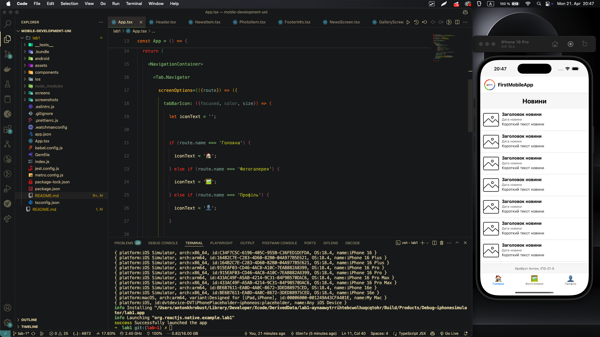
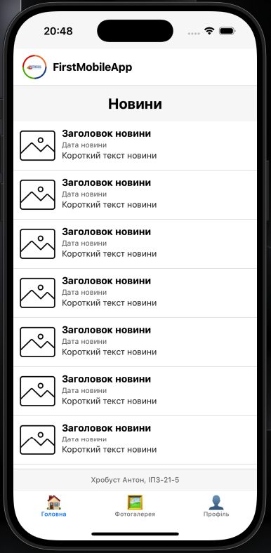
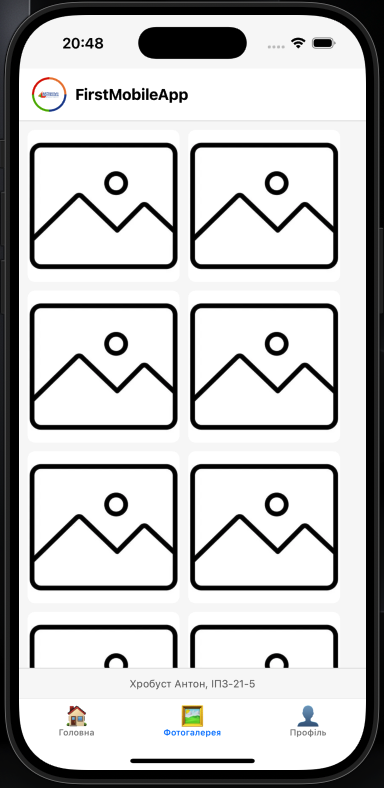
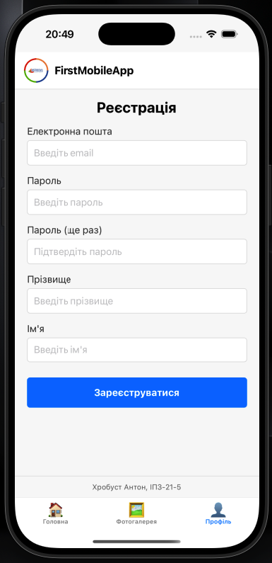

# Mobile Development Lab 1

This is a simple React Native mobile application, demonstrating the use of Expo and React Native for building a basic mobile application with multiple screens and navigation.

## Project Description

The application contains three main screens:
1. News Feed - displays a list of news items
2. Photo Gallery - shows a grid of photos
3. Registration - provides a form for user registration

## Installation and Setup

### Prerequisites
- Node.js (14.0 or later)
- npm or yarn
- Xcode (for iOS development)
- CocoaPods
- React Native CLI

### Installation Steps

1. Clone the repository:
```bash
git clone https://github.com/t0nn1x/mobile-development-uni.git
cd mobile-development-uni/lab1
```

2. Install dependencies:
```bash
npm install
```

3. Install iOS pods:
```bash
cd ios
pod install
cd ..
```

4. Run the application on iOS simulator:
```bash
npx react-native run-ios
```

5. To run on a physical iOS device, open the project in Xcode:
```bash
open ios/lab1.xcworkspace
```
Then select your device and press Run.

## Project Structure

```
/lab1
  ├── App.tsx                  // Main App component with navigation
  ├── components/              // Reusable components
  │   ├── Header.tsx           // Common header component
  │   ├── NewsItem.tsx         // News list item component 
  │   ├── PhotoItem.tsx        // Photo gallery item component
  │   └── FooterInfo.tsx       // Common footer component
  ├── screens/                 // App screens
  │   ├── NewsScreen.tsx       // News feed screen
  │   ├── GalleryScreen.tsx    // Photo gallery screen 
  │   └── ProfileScreen.tsx    // Registration/profile screen
  ├── assets/                  // Images and other static assets
  │   ├── logo.webp            // App logo
  │   └── placeholder.webp     // Placeholder image
  └── screenshots/             // Screenshots for documentation
```

## Screenshots

### Dev Environment


### News Screen


### Gallery Screen


### Registration Screen


## Technologies Used

- React Native
- React Navigation (for tab-based navigation)
- React Hooks (useState, useEffect)
- TypeScript
- SafeAreaView for iOS notch compatibility

## Code Style Guidelines

The project follows these code style guidelines:
- Avoiding code duplication by creating reusable components
- Modular architecture with self-contained components
- Clear separation of concerns between screens and components
- Consistent naming conventions and code formatting

## Author

Created by Khrobust Anton, IPZ-21-5.
