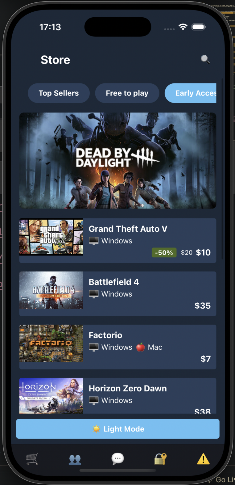
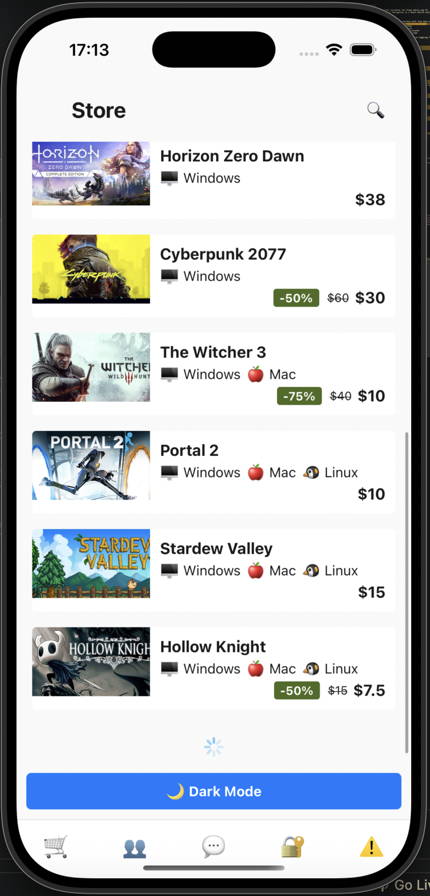
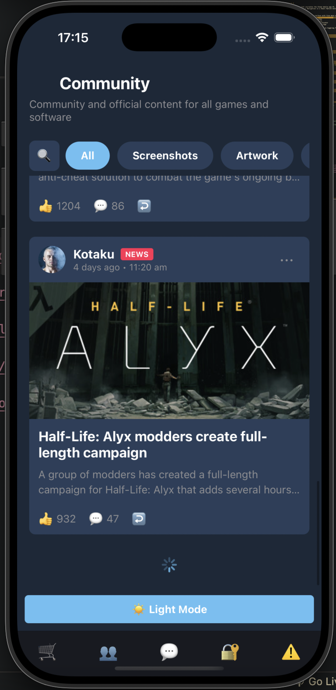
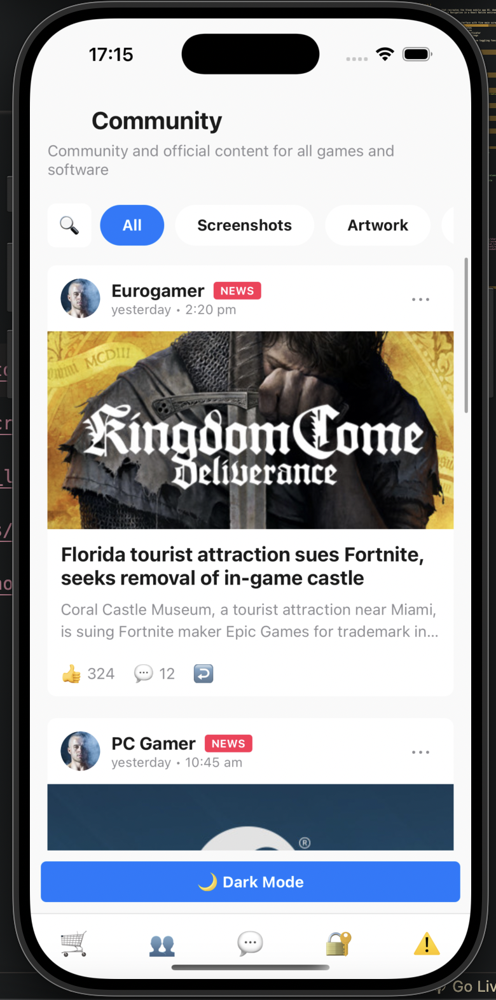
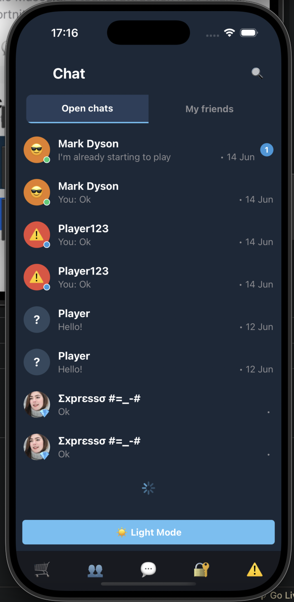
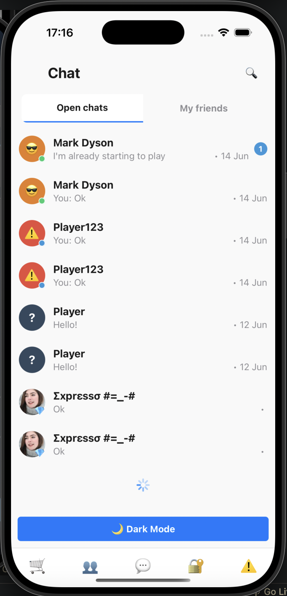
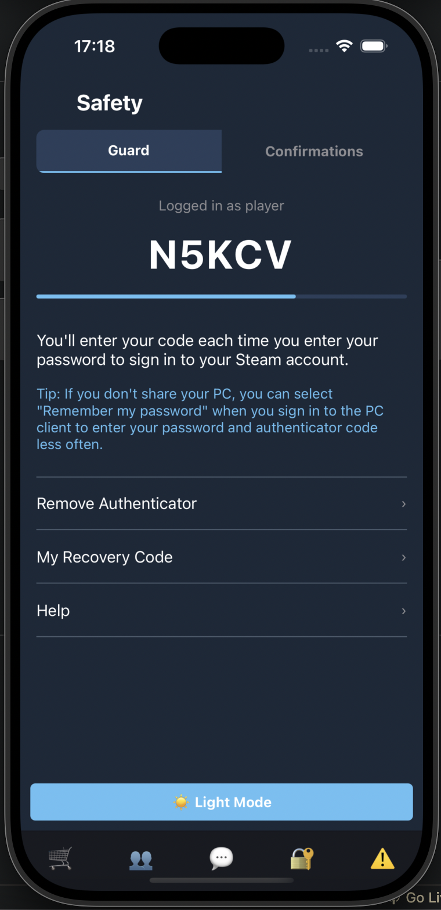
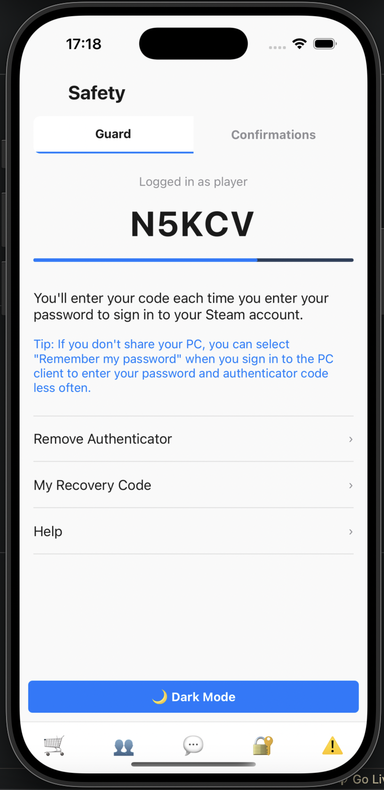
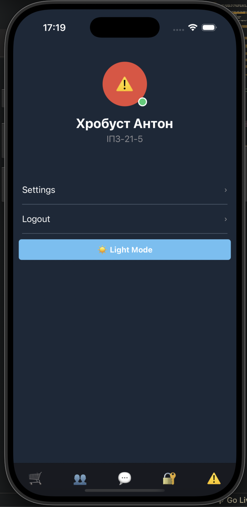
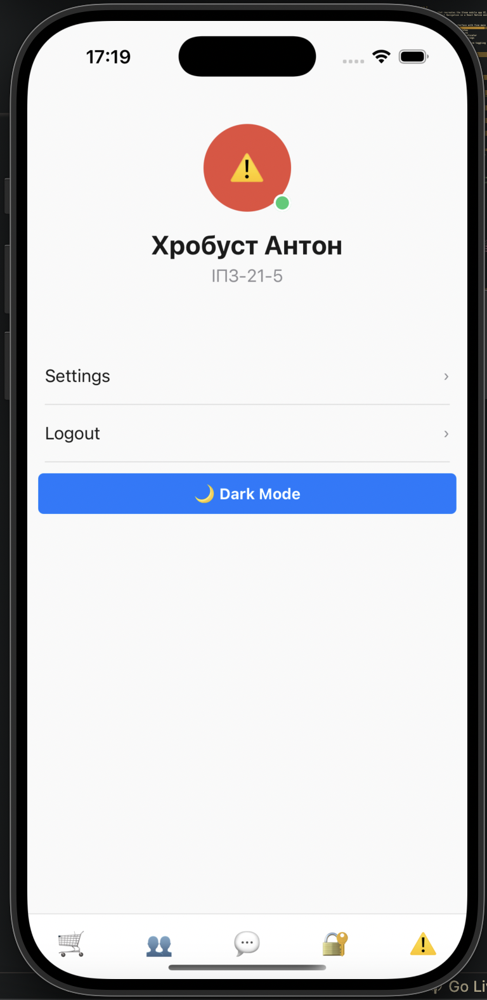

# Mobile Development Lab 2

A React Native mobile application that recreates the Steam mobile app UI, demonstrating the use of styled components, theming, FlatList, and React Navigation in a React Native environment.

## Project Description

This application is a clone of the Steam mobile interface with five main screens:
1. **Store** - Displays game listings with featured items and discounts
2. **Community** - Shows a feed of gaming news and updates
3. **Chat** - Provides an interface for user conversations
4. **Safety** - Shows account security settings and authenticator
5. **Profile** - Displays user profile information and settings

The application supports both dark and light themes, with theme toggling functionality.

## Installation and Setup

### Prerequisites
- Node.js (14.0 or later)
- npm or yarn
- Expo CLI
- iOS Simulator (for iOS development)
- Android Studio and Emulator (for Android development)

### Installation Steps

1. Clone the repository:
```bash
git clone https://github.com/t0nn1x/mobile-development-uni.git
cd mobile-development-uni/lab2
```

2. Install dependencies:
```bash
npm install @react-navigation/native @react-navigation/bottom-tabs react-native-screens react-native-safe-area-context --legacy-peer-deps
```

3. Start the Expo development server:
```bash
npx expo start
```

4. Run the application on iOS simulator:
```bash
npx expo start --ios
```

5. Run the application on Android emulator:
```bash
npx expo start --android
```

## Project Structure

```
/lab2
  ├── App.tsx                      // Main App component with navigation
  ├── components/                  // Reusable components
  │   ├── BottomTabBar.tsx         // Custom tab bar component
  │   ├── ChatItem.tsx             // Chat list item component
  │   ├── GameCard.tsx             // Game card component for Store
  │   ├── NewsCard.tsx             // News item component
  │   └── ThemeToggle.tsx          // Theme toggling button
  ├── constants/                   // Application constants
  │   ├── Colors.ts                // Color definitions for themes
  │   └── Layout.ts                // Layout dimensions and responsive values
  ├── contexts/                    // React contexts
  │   └── ThemeContext.tsx         // Theme context for global theme state
  ├── data/                        // Mock data files
  │   ├── chatsData.ts             // Chat conversation data
  │   ├── gamesData.ts             // Game listing data
  │   └── newsData.ts              // Community news data
  ├── navigation/                  // Navigation configuration
  │   └── index.tsx                // Navigation setup with bottom tabs
  ├── screens/                     // App screens
  │   ├── StoreScreen.tsx          // Game store screen
  │   ├── CommunityScreen.tsx      // Community news screen
  │   ├── ChatScreen.tsx           // Chat conversations screen
  │   ├── SafetyScreen.tsx         // Account safety settings screen
  │   └── ProfileScreen.tsx        // User profile screen
  └── theme/                       // Theme configuration
      └── index.ts                 // Theme definitions and types
```

## Screenshots

### UI Comparison - Dark and Light Themes

| Dark Theme | Light Theme |
|------------|-------------|
|  |  |
|  |  |
|  |  |
|  |  |
|  |  |

## Technologies Used

- React Native
- Expo
- React Navigation (for bottom tab navigation)
- styled-components/native (for styling with theme support)
- TypeScript
- FlatList (for optimized list rendering)
- React Context API (for theme management)

## Code Style Guidelines

The project follows these code style guidelines:
- Component modularity for improved reusability
- Separation of styling with styled-components
- Type safety using TypeScript interfaces
- Theme-aware components using context
- Infinite scroll implementation for lists
- Consistent naming conventions and code formatting

## Author

Created by Khrobust Anton, IPZ-21-5.
