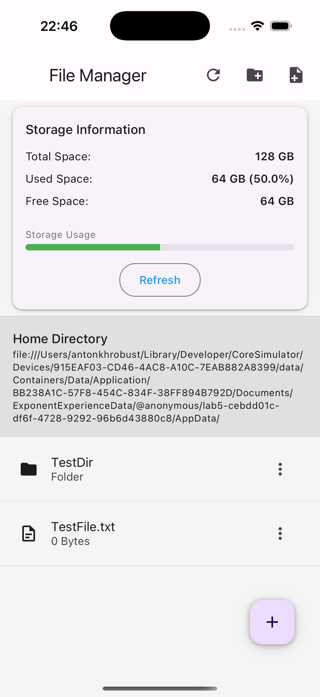
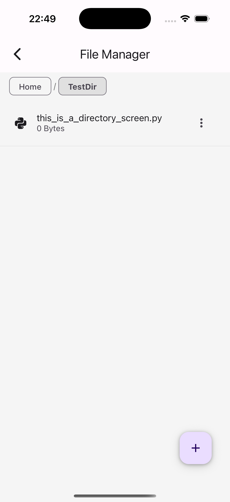
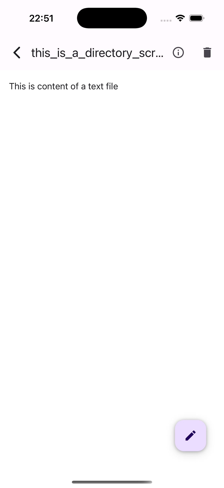
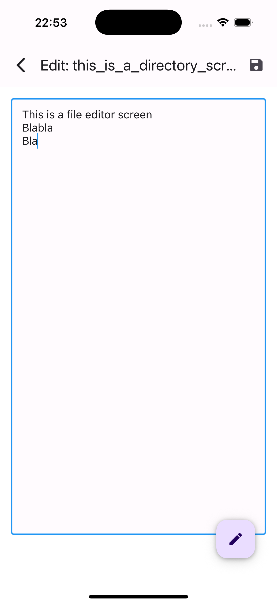

# Mobile Development Lab 5

**Lab 5: File System in React Native using `expo-file-system`**

---

## 📋 Project Description

This is a React Native mobile application built with Expo that implements a basic **File Manager**. It demonstrates how to work with the device’s local file system (within `FileSystem.documentDirectory + 'AppData'`) using the [`expo-file-system`](https://docs.expo.dev/versions/latest/sdk/filesystem/) library.

### Key Features

1. **Directory Navigation**  
   - Display current path as a breadcrumb or header.  
   - List files and folders in the current directory.  
   - Enter nested folders and go back “up” one level.

2. **Create**  
   - Create a new folder with a user‑provided name.  
   - Create a new text file with a given name, type and initial content.

3. **Read**  
   - Open and view the contents of text files.

4. **Edit**  
   - Modify text file content in a built‑in editor.  
   - Save changes back to the original file.

5. **Delete**  
   - Delete files or folders (with confirmation prompt).

6. **Details**  
   - View metadata for any file/folder:  
     - Name  
     - Type (by extension)  
     - Size  
     - Last modified date

7. **Storage Statistics** (Home Screen)  
   - Display total device storage, used space, and free space (mocked on simulator).

8. **AppData Directory Initialization**  
   - On first launch, automatically create `AppData/` if it doesn’t exist.  
   - All file operations are scoped under `FileSystem.documentDirectory + 'AppData'`.

---

## 🚀 Installation & Setup

### Prerequisites

- **Node.js** ≥ 14  
- **npm** or **yarn**  
- **Expo CLI**  
- **iOS Simulator** (Xcode) or **Android Emulator** / Device

### Steps

1. **Clone the repo**  
```bash
git clone https://github.com/t0nn1x/mobile-development-uni.git
cd mobile-development-uni/lab5
```

2. **Install dependencies**  
```bash
npm install
# or
yarn install
```

3. **Start Expo**  
```bash
expo start
```

4. **Run on iOS simulator**  
Press `i` in the Expo CLI, or:
```bash
expo run:ios
```

5. **Run on Android**  
Press `a` in the Expo CLI, or:
```bash
expo run:android
```

---

## 🗂 Project Structure

```
/lab5
├── App.tsx                   # Root component & navigator
├── app.json                  # Expo configuration
├── tsconfig.json             # TypeScript configuration
├── package.json
├── assets/                   # Icons, splash, favicon
├── components/               # Reusable UI components
│   ├── CreateNewItem.tsx
│   ├── DirectoryHeader.tsx
│   ├── FileActions.tsx
│   ├── FileDetails.tsx
├── index.ts                  # Expo entry point
│   ├── FileItem.tsx
│   ├── StorageInfo.tsx
│   └── TextEditor.tsx
├── context/                  # File system context/provider
│   └── FileSystemContext.tsx
├── hooks/                    # Custom hooks
│   └── useFileSystem.ts
├── screens/                  # App screens
│   ├── HomeScreen.tsx
│   ├── DirectoryScreen.tsx
│   ├── FileViewScreen.tsx
│   └── FileEditScreen.tsx
└── utils/                    # File utility functions
    └── fileUtils.ts
```

---

## 📸 Screenshots

<!--
Add your own screenshots here in `./screenshots/`
-->

1. **Home Screen**  
   

2. **Directory View**  
   

3. **File Viewer**  
   

4. **File Editor**  
   

---

## 🎥 Video Presentation

*A short demo of the app in action.*  

[](https://drive.google.com/file/d/1VjQ9zBDEdyEUDpXfEXSWzCW9g6f0pv94/view?usp=drivesdk)

---

## 🔧 Technologies & Libraries

- **React Native**  
- **Expo**  
- **expo-file-system** (local FS API)  
- **React Navigation (Stack)**  
- **react-native-paper** (UI components)  
- **TypeScript**  

---

## 💡 Implementation Notes

- **FlatList** is used for directory listings (files & folders).  
- **TextInput** + **Modal Dialogs** (or separate screens) handle file/folder creation and text editing.  
- **Portal** from `react-native-paper` is used for floating action buttons (FABs) & dialogs.  
- All file operations (read/write/delete) are wrapped in a context (`FileSystemContext`) to share state across screens.  
- **Breadcrumb navigation** is implemented in `DirectoryHeader` for clear path display and quick jumps.

---

## 👤 Author

**Anton Khrobust** (IPZ‑21‑5)  

---
